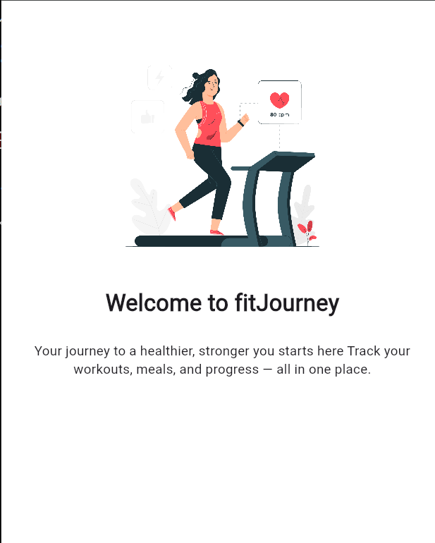

# fitnessApp
## head 2
### head 3
#### head 4
##### head 5
###### head 6
## teachnologies used
- html
- css
- javaScript
- React
- nodeJs
    - express
    - npm
- mongoDb
    - mongoose


## ordered list
1. List 1
2. List 2
3. List 3
4. List 4

## code snippet
``` dart
void main(){
  print('hello world');
}
```

## link
[google](http://www.google.com)

i am learning [gitHub](https://github.com/dashboard) is a platform for hosting projects and websites

